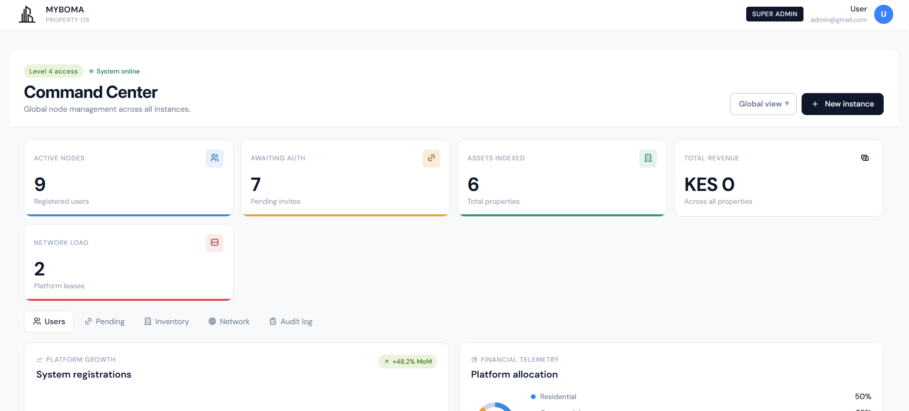
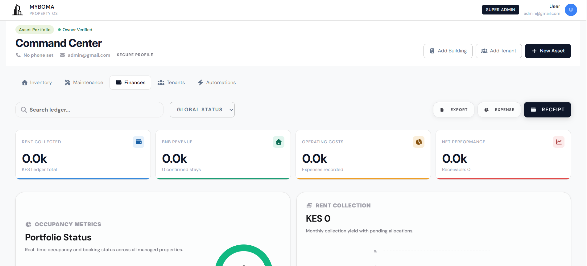

<div align="center">

</div>

# Run and deploy your AI Studio app

This contains everything you need to run your app locally.

View your app in AI Studio: https://ai.studio/apps/391619cf-c0d8-4adb-88a9-dd2550883735

## Run Locally

**Prerequisites:**  Node.js


1. Install dependencies:
   `npm install`
2. Set the `GEMINI_API_KEY` in [.env.local](.env.local) to your Gemini API key
3. Run the app:
   `npm run dev`
# MyBoma - Property OS

## PWA

The app is configured as an installable Progressive Web App with a generated manifest, service worker, and app icons.

```bash
npm install
npm run build
npm run preview -- --host 0.0.0.0 --port 4173
```

Open `http://localhost:4173/` to test the built PWA locally. Phone installs require HTTPS in production; `localhost` is accepted for local desktop testing.

## Android and iPhone Apps

This project uses Capacitor to package the same Vite app for Android and iOS.

```bash
npm run mobile:sync
```

Android:

```bash
npm run mobile:open:android
npm run mobile:android
```

The Android debug APK builds to `android/app/build/outputs/apk/debug/app-debug.apk`.

iPhone:

```bash
npm run mobile:open:ios
npm run mobile:ios
```

iOS builds must be run on macOS with Xcode. The generated iOS project is in `ios/App`.

Native mobile builds use `VITE_SUPABASE_URL` directly instead of the local gateway, because `localhost:3001` is not available from phone WebViews.
Set `VITE_API_BASE_URL` to your deployed HTTPS gateway URL before building Android/iOS so BFF calls can reach `/api/mobile` from a phone.

## API Gateway and BFF

The Express gateway exposes separate BFF prefixes for web and mobile:

```bash
npm run server
```

- Web BFF: `/api/web`
- Mobile BFF: `/api/mobile`
- Legal documents: `/api/legal`
- Waitlist signup: `POST /api/waitlist`
- Waitlist unsubscribe: `POST /api/waitlist/unsubscribe`
- Stripe webhook: `/api/webhooks/stripe`
- Pesapal callback: `/api/payments/pesapal/callback`
- Pesapal IPN listener: `/api/webhooks/pesapal/ipn`
- M-Pesa STK callback: `/api/webhooks/mpesa/stk`

All public API routes and webhooks are rate limited. BFF routes require a Supabase bearer token, validate request bodies with Zod, sanitize string input, and keep provider secrets on the server.

Before enabling payments in production:

1. Copy `.env.example` to `.env` and fill the server-only keys.
2. Run `supabase-setup.sql` in Supabase to add legal acceptance, payment metadata, and the public waitlist storage table. For an existing deployment, apply the needed files in `docs/migrations/`, including `pesapal-payments.sql`.
3. Configure Stripe webhook events for `checkout.session.completed` and `checkout.session.async_payment_succeeded`.
4. Configure Pesapal API 3.0:
   - Website URL: `https://myboma.vercel.app`
   - Callback URL: `https://myboma.vercel.app/api/payments/pesapal/callback`
   - IPN listener URL: `https://myboma.vercel.app/api/webhooks/pesapal/ipn`
   - Register the IPN listener in Pesapal and set the returned IPN ID as `PESAPAL_NOTIFICATION_ID`.
5. Configure M-Pesa Daraja STK callback URL to `/api/webhooks/mpesa/stk?secret=YOUR_MPESA_CALLBACK_SECRET` (or send header `X-Mpesa-Callback-Secret`). Set `MPESA_CALLBACK_SECRET` in production.
6. Set `SUPER_ADMIN_EMAILS` and `VITE_SUPER_ADMIN_EMAILS` (comma-separated) for bootstrap super admins — then remove reliance on hardcoded emails in the database.
7. Keep `ENABLE_SUPABASE_PROXY=false` in production unless you intentionally proxy PostgREST through the gateway.
8. Configure SMTP if landlord/tenant notifications and waitlist confirmation emails should be sent.
9. Add each landlord payout configuration:
   - Stripe: `users.stripeAccountId` must be a Stripe Connect account ID.
   - M-Pesa: `users.mpesaSettlementPhone` is used for optional B2C settlement after successful STK confirmation.

M-Pesa STK Push collects to the configured business shortcode. To move funds onward to landlords automatically, enable and configure the B2C settlement env vars.

## Legal and Monitoring

Signup requires acceptance of the current Terms and Conditions and Privacy Policy versions before account creation. Copies live in:

- `docs/terms-of-use.md`
- `docs/privacy-policy.md`

Sentry is optional and enabled by setting `VITE_SENTRY_DSN` for the app and `SENTRY_DSN` for the gateway. The config disables default PII collection.

Admin Dashboard:


Landing page:


Landlord:

